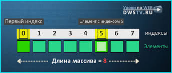
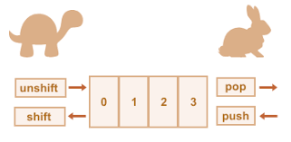
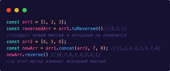
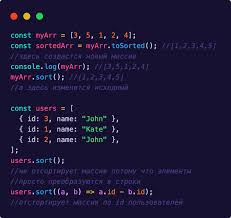
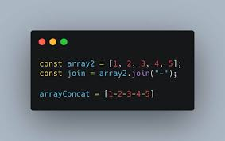
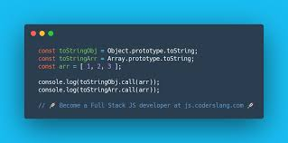
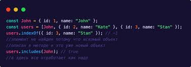
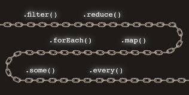

# Array в JS

Объект Array , как и массивы в других языках программирования, позволяет хранить коллекцию из нескольких элементов под одним именем переменной и имеет методы для выполнения общих операций с массивами.

### Особенности массива в JS:

* В массиве хранятся значения смешанных типов. То есть, массив может содержать в себе числа, строки и объекты других массивов.

* У длины массива — динамический характер. Нам не надо заранее указывать размер массива — он меняется (увеличивается/уменьшается) автоматически.

* Его применяют для содержания нескольких значений в одной переменной.

Пара квадратных скобок [] обозначает массив, элементы разделяются запятыми (,). Положение элемента в массиве обозначается индексом.

# Методы изменения массива

push() : Добавляет один или более элементов в конец массива и возвращает новую длину массива.

pop() : Удаляет последний элемент из массива и возвращает его.

unshift() : Добавляет один или более элементов в начало массива и возвращает новую длину массива.

shift() : Удаляет первый элемент из массива и возвращает его.

splice() : Добавляет и/или удаляет элементы из массива.

reverse() : Переворачивает порядок элементов в массиве — первый элемент становится последним, а последний — первым.

sort() : Сортирует элементы массива на месте и возвращает отсортированный массив. Для сортировки числовых значений есть дополнительная функция. Сортировка по убыванию sort(function(a, b){return b-a}), или по возрастанию {return a-b}. Те же самые действия можем делать при помощи знака (< или >).

## Методы доступа

concat() : Возвращает новый массив, состоящий из данного массива, соединённого с другим массивом и/или значением (списком массивов/значений).

join() : Объединяет все элементы массива в строку как toString(), и дополнительно можно указать свой разделитель.

slice() : Извлекает диапазон значений и возвращает его в виде нового массива.

toString() : Возвращает строковое представление массива и его элементов. Переопределяет метод Object.prototype.toString().

toLocaleString() : Возвращает локализованное строковое представление массива и его элементов. Переопределяет метод Object.prototype.toLocaleString().

indexOf() : Возвращает первый (наименьший) индекс элемента внутри массива, равный указанному значению; или -1, если значение не найдено.

lastIndexOf() : Возвращает последний (наибольший) индекс элемента внутри массива, равный указанному значению; или -1, если значение не найдено.

## Методы обхода

forEach() : Вызывает функцию для каждого элемента в массиве.

every()	: Возвращает true, если каждый элемент в массиве удовлетворяет условию проверяющей функции.

some() : Возвращает true, если хотя бы один элемент в массиве удовлетворяет условию проверяющей функции.

filter() : Создаёт новый массив со всеми элементами этого массива, для которых функция фильтрации возвращает true.

map() : Создаёт новый массив с результатами вызова указанной функции на каждом элементе данного массива.

reduce() : Применяет функцию к аккумулятору и каждому значению массива (слева-направо), сводя его к одному значению.

reduceRight() : Применяет функцию к аккумулятору и каждому значению массива (справа-налево), сводя его к одному значению.

<!--  -->